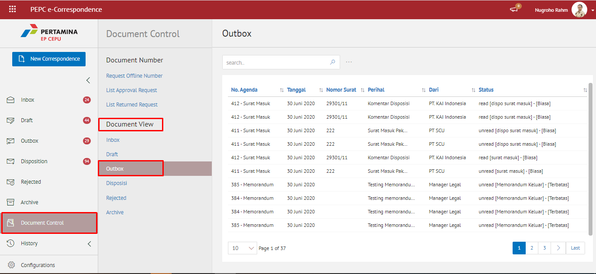

###  **Melihat Daftar Dokumen Disposisi**

**Role yang sesuai**

- Sekretaris
- Pemilik KBO

_User_ dapat melihat daftar dokumen keluar yang mencatatkan seluruh dokumen yang didisposisikan kepada jabatan atasan sekretaris. Langkah - langkah untuk melihat daftar dokumen disposisi adalah sebagai berikut

1. Klik menu **Document Control** dan pilih submenu **Dokumen Disposisi**

2. Sistem menampilkan dokumen disposisi yang informasinya meliputi no agenda, tanggal, nomor surat, perihal, dari/asal, status dan *secretary notes*