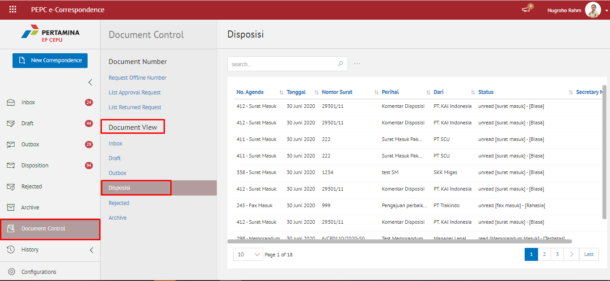
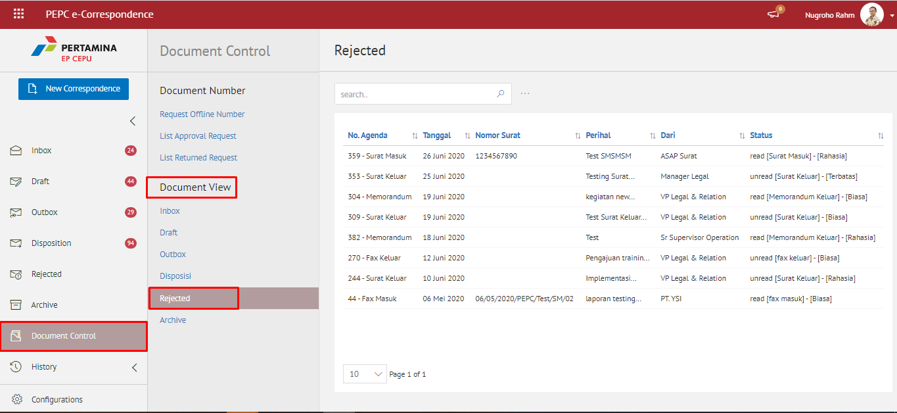
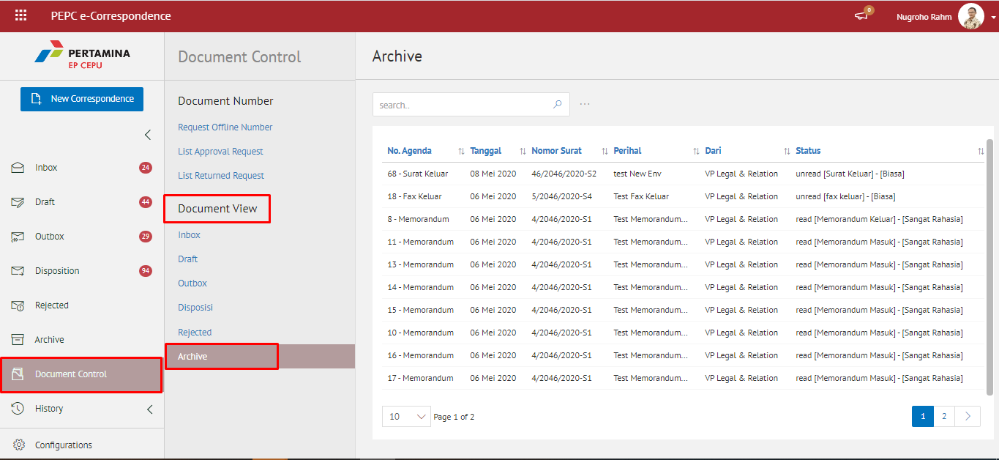
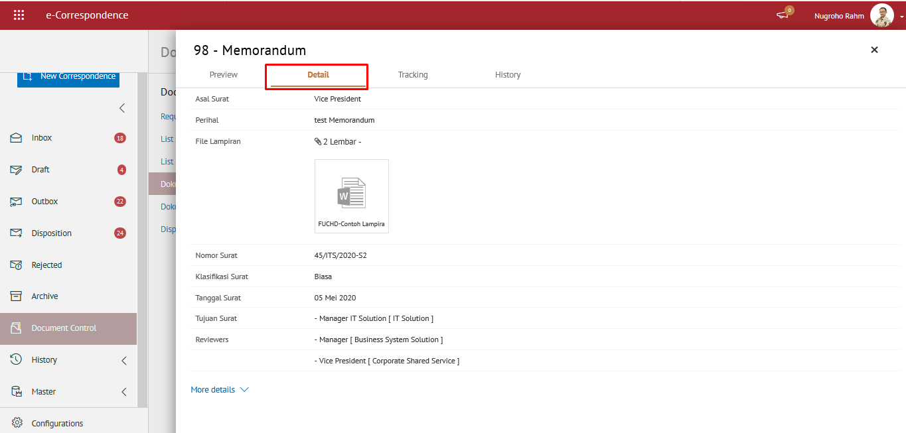
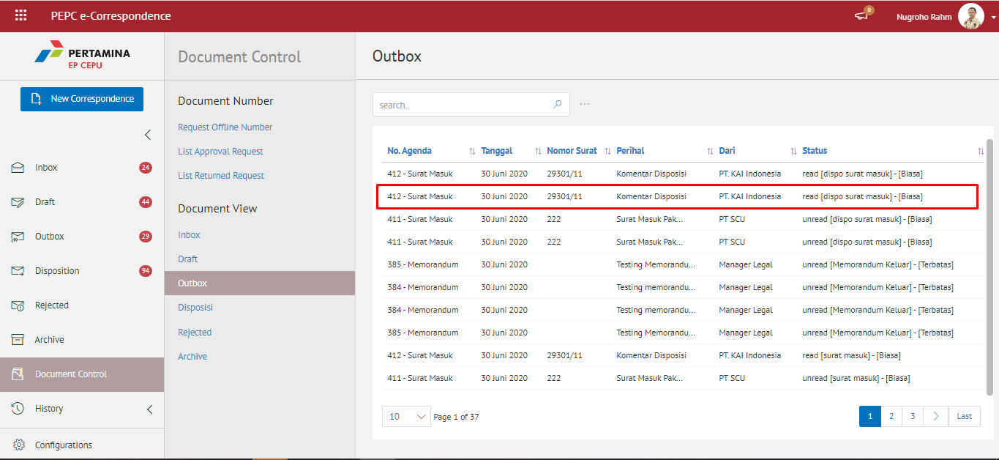
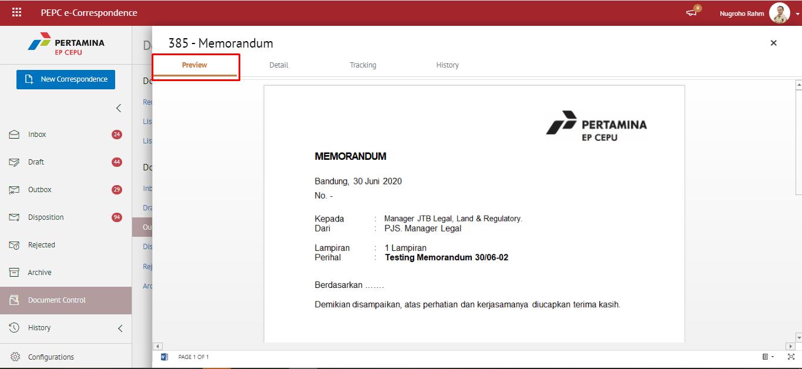

#### **Melihat Detail Surat**

**Role yang sesuai**

- Sekretaris
- Pemilik KBO

_User_ dapat melihat detail surat baik surat yang berklasifikasi “Biasa”, “Terbatas”, “Rahasia” dan “Sangat Rahasia”. Sedangkan sebagai *role* sekretaris hanya dapat melihat detail surat yang berklasifikasi “Biasa” dan “Terbatas”. Informasi yang ditampikan detail surat antara lain yaitu

Langkah - langkah untuk melakukan melihat detail dokumen masuk, dokumen keluar dan dokumen disposisi adalah sebagai berikut.

1. Klik menu **Document Control** dan pilih tab **Dokumen Masuk / Dokumen Keluar / Dokumen Disposisi**

2. Klik salah satu surat yang akan dilihat detailnya

3. Sistem akan menampilkan detail surat yang dipilih

   - **Preview Surat**
    
       Pada tab **Preview Surat**, ditampilkan _preview_ surat yang sudah dibuat. _Preview_ surat disesuaikan dengan template berdasarkan jenis surat

        

   - **Detail Surat**
    
       Pada tab **Detail Surat**, terdapat informasi asal surat, perihal, file lampiran, nomor surat, klasifikasi surat, tanggal surat, tujuan surat

        

   - **Tracking Surat**
   
       Pada tab **Tracking Surat**, ditampilkan informasi *tracking* memorandum dalam bentuk *chart*

       

   - **History Surat**
    
       Pada tab **History Surat**, ditampilkan riwayat memorandum yang terdapat informasi jabatan, tanggal, tindakan dan komentar

       