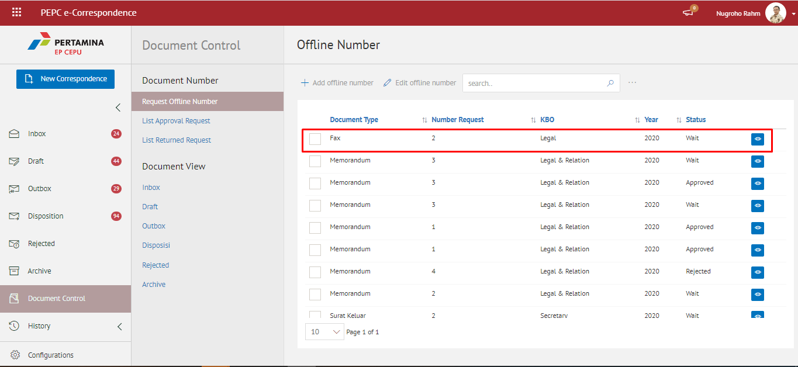

### **Menyetujui Permintaan Nomor Offline**

**Role yang sesuai**

- Admin Approver Offline Number

Admin Approver Offline Number dapat melakukan tindak lanjut terhadap permintaan nomor offline dengan menyetujui permintaan yang diajukan oleh sekretaris. Langkah - langkah untuk menyetujui permintaan nomor adalah sebagai berikut

1. Klik menu **Document Control** dan pilih tab **Approval List**

2. Pilih nomor offline yang akan disetujui kemudian pilih tombol **Approve**

3. Sistem berhasil menyimpan perubahan dan nomor offline yang disetujui akan tampil di menu "**Document Control - List Approval Request**” dengan status **Approved** pada role admin eCorr. Sedangkan untuk role sekretaris tersimpan di menu "**Document Control - Request Offline Number**”  dengan status **Approved**
