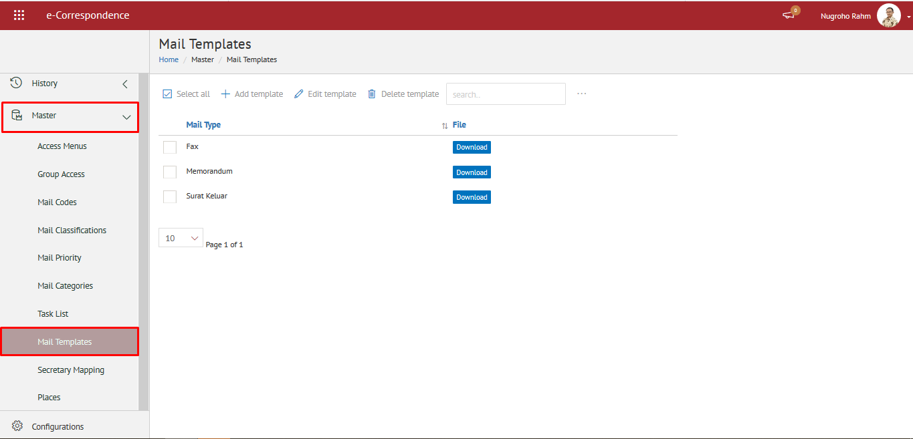
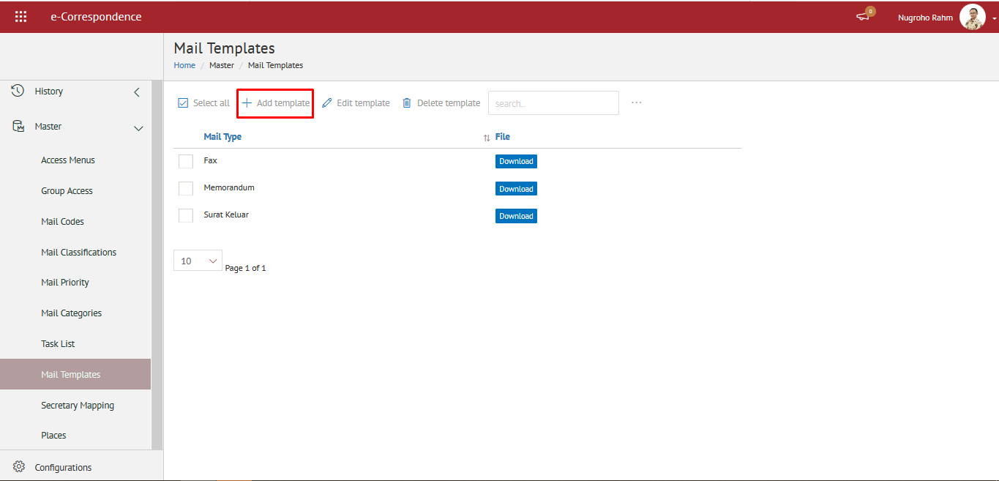
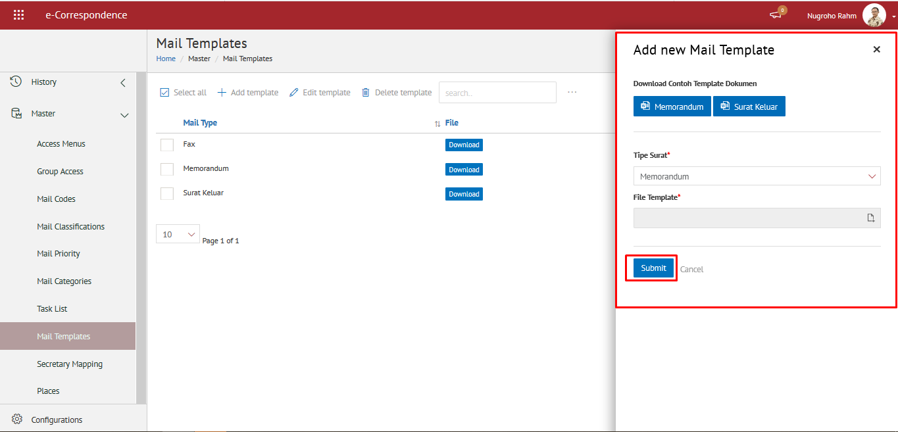

###  	**Mengelola Template Surat**

**Role yang sesuai**

 - Admin eCorr

Admin eCorr dapat mengelola _template _surat yang digunakan dalam proses _generate_ surat. Pengelolaan template surat yang dilakukan oleh admin eCorr antara lain yaitu

- Mencari _template_ surat
- Menambah _template_ surat
- Mengubah _template_ surat
- Menghapus _template_ surat
- Mengunduh_ template_ surat

Langkah - langkah untuk pengelolaan _template_ surat adalah sebagai berikut:

#### **Mencari Mail Template**

1.    Pilih menu **Master** dan pilih submenu **_Mail Template_**

2.    Pilih tombol **Search** dan masukkan pencarian berdasarkan kata kunci, kemudian klik **Enter**

#### **Menambah Mail Template**

1.    Pilih menu **Master** dan pilih submenu **_Mail Template_**

2.    Pilih tombol **+ Add Template** untuk menambah _template_

3.    Pilih tipe surat dan unggah _file template_ kemudian klik **Submit**

4.    Sistem menyimpan perubahan dan data akan muncul di halaman daftar _template._

#### **Mengubah Mail Template**

1.    Pilih menu **Master** dan pilih submenu **_Mail Template_**

2.    Klik checklist pada _template_ yang akan diubah kemudian klik tombol **Edit Template**

3.    Lakukan perubahan pada _template,_ pilih **Cancel** untuk membatalkan proses

4.    Lakukan perubahan pada _template_ kemudian klik tombol **Submit**

5.    Sistem menyimpan perubahan dan data akan muncul di halaman daftar _template_

#### **Menghapus Mail Template**

1.    Pilih menu **Master** dan pilih submenu **_Mail Template_**

2.    Klik checklist pada _template_ yang akan dihapus kemudian klik icon **Delete**

3.    Klik tombol **Cancel** untuk membatalkan proses

4.    Klik tombol **Ya** untuk menghapus _template_

5.    Sistem menyimpan perubahan dan data akan terhapus dari daftar _template_

#### **Mengunduh Mail Template**

1.    Pilih menu **Master** dan pilih submenu **_Mail Template_**

2.    Pilih _template_ surat yang akan diunduh. Klik tombol **Download** untuk mengunduh _template_ surat

3.    Sistem berhasil mengunduh _template_ surat
