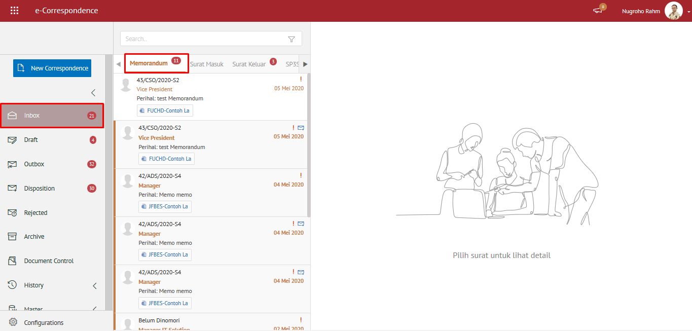

### Memorandum

Pada modul ini mendukung proses pembuatan konsep memorandum yang akan disetujui oleh *reviewer/approver*. Setelah memorandum disetujui maka akan diberikan nomor memorandum secara otomatis dan dikirimkan ke pejabat pemilik Kode Bagian Organisasi (KBO). Pemilik KBO tersebut akan mendapatkan memorandum masuk pada menu **"Inbox”** dan dapat mendisposisikan memorandum kepada pejabat yang dipilih atau pejabat yang ada di bawahnya sampai dengan level staf.

#### Melihat Daftar Memorandum

**Role yang sesuai**

- Konseptor
- *Reviewer*
- *Approver*

*User* dapat melihat daftar memorandum pada pada menu **Inbox, Draft atau Outbox** pada masing - masing akun. Langkah - langkah untuk melihat daftar memorandum adalah sebagai berikut

1. Klik menu **Inbox / Draft / Outbox** dan pilih tab **Memorandum**

