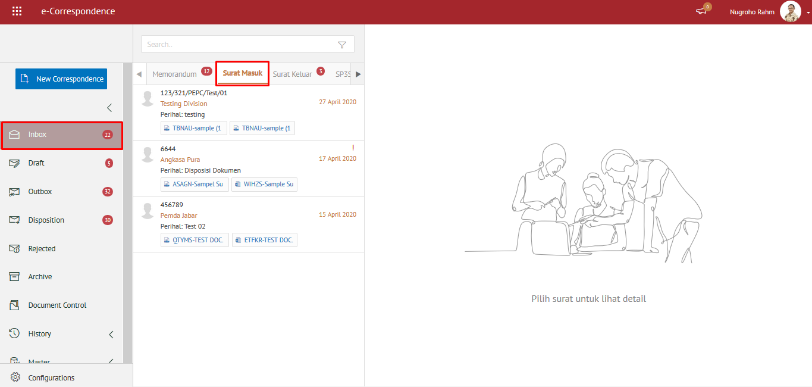

### **Melihat Daftar Surat Masuk**

**Role yang sesuai**

- Semua _user_

 _User_ dapat melihat daftar surat masuk yang ditujukan pada sekretaris tersebut. Langkah-langkah untuk melihat daftar surat masuk adalah sebagai berikut:

 1.    Klik menu **Inbox** dan pilih tab **Surat Masuk**. Sistem akan menampilkan daftar surat masuk yang ditujukan pada suatu _user_

